# 📈 CORNMAN Strategic HQ - Business Process Diagrams

> **Diagram Proses Perniagaan untuk Sistem CORNMAN Strategic HQ**
> 
> Dokumen ini menunjukkan aliran kerja perniagaan, proses pengurusan, dan integrasi operasi harian.

## 🎯 **BUSINESS WORKFLOW OVERVIEW**

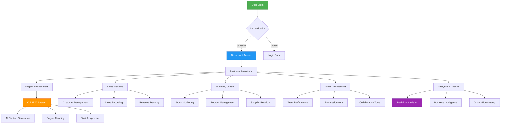

## 📊 **PROJECT C.R.E.W. WORKFLOW**

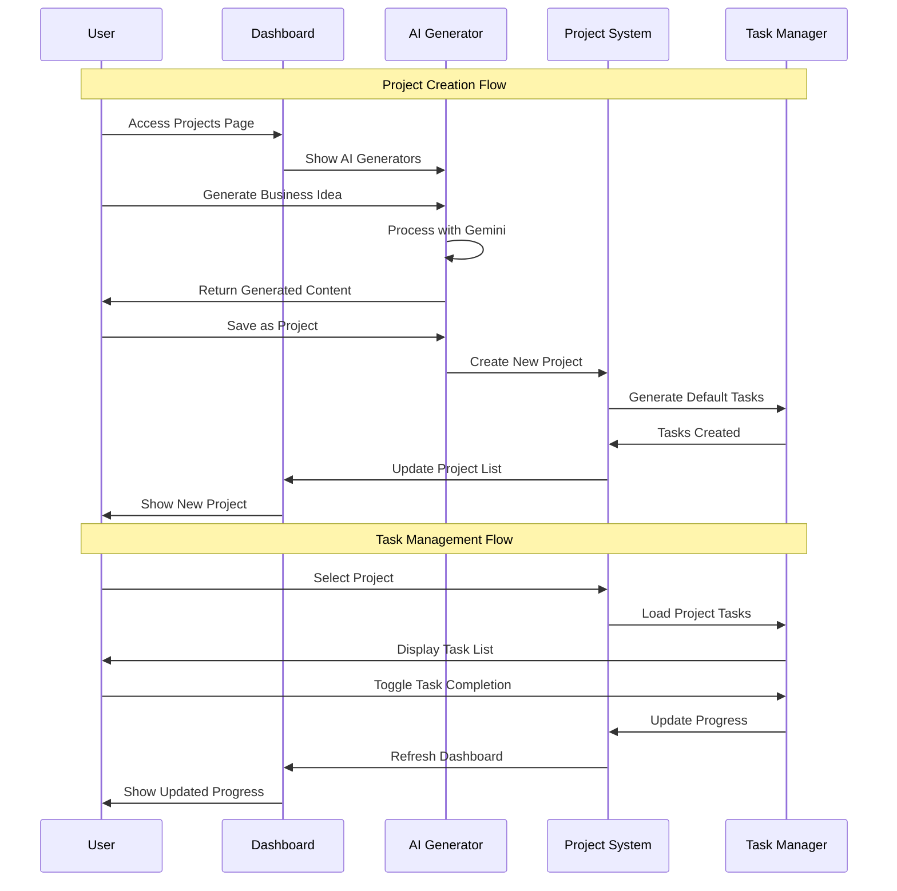

## 🛒 **SALES & INVENTORY PROCESS**

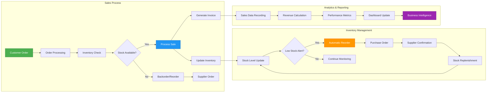

## 🤖 **AI CONTENT GENERATION PROCESS**

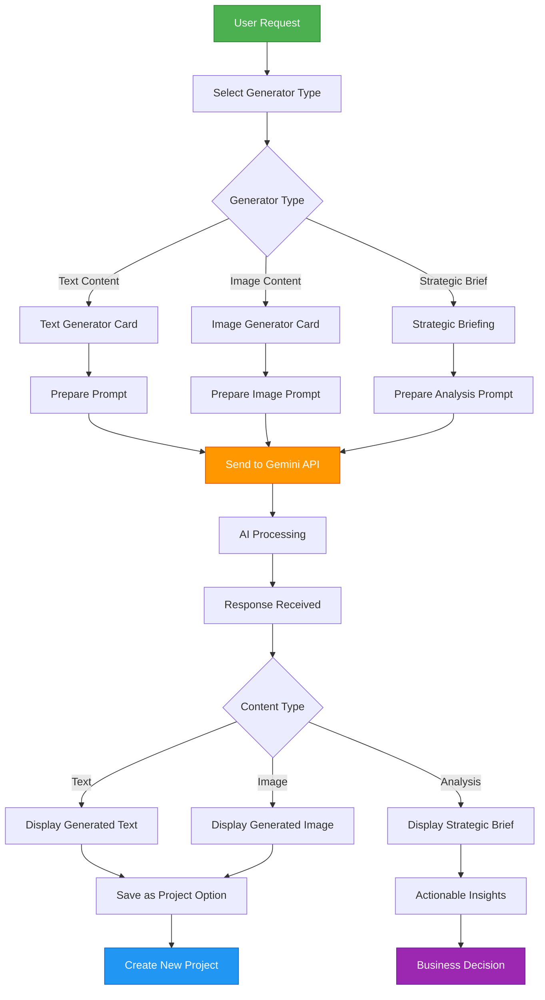

## 📱 **WHATSAPP INTEGRATION FLOW**

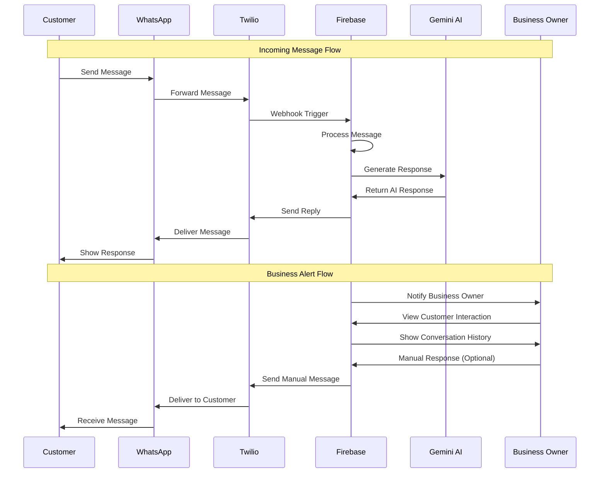

## 👥 **TEAM MANAGEMENT PROCESS**

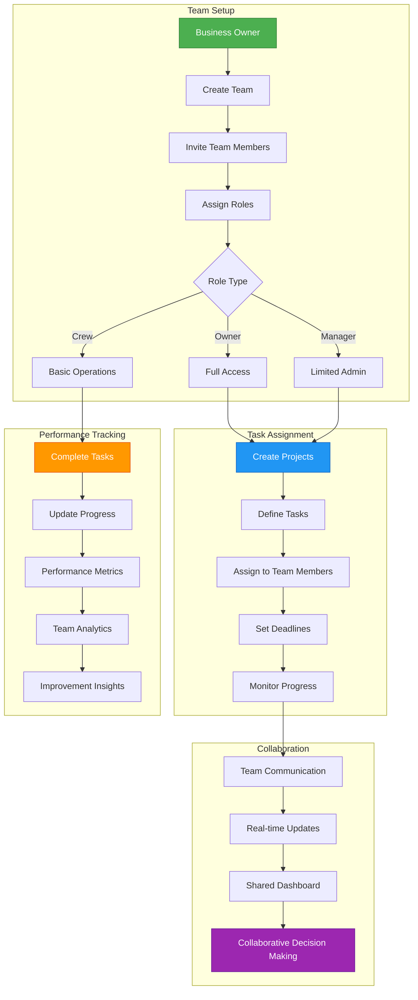

## 📊 **ANALYTICS & REPORTING WORKFLOW**

```mermaid
flowchart LR
    subgraph "Data Collection"
        A[User Interactions] --> D[Data Aggregation]
        B[Sales Transactions] --> D
        C[System Events] --> D
    end
    
    subgraph "Processing"
        D --> E[Real-time Processing]
        E --> F[Data Validation]
        F --> G[Metric Calculation]
        G --> H[Trend Analysis]
    end
    
    subgraph "Visualization"
        H --> I[Dashboard Updates]
        I --> J[Chart Generation]
        J --> K[KPI Display]
        K --> L[Alert Generation]
    end
    
    subgraph "Intelligence"
        L --> M[AI Analysis]
        M --> N[Pattern Recognition]
        N --> O[Predictive Insights]
        O --> P[Actionable Recommendations]
    end
    
    subgraph "Decision Making"
        P --> Q[Strategic Planning]
        Q --> R[Business Optimization]
        R --> S[Performance Improvement]
        S --> T[Growth Acceleration]
    end
    
    style D fill:#4CAF50,stroke:#2E7D32,color:#fff
    style I fill:#2196F3,stroke:#1565C0,color:#fff
    style M fill:#FF9800,stroke:#E65100,color:#fff
    style Q fill:#9C27B0,stroke:#6A1B9A,color:#fff
```

## 🔄 **DAILY OPERATIONS CYCLE**

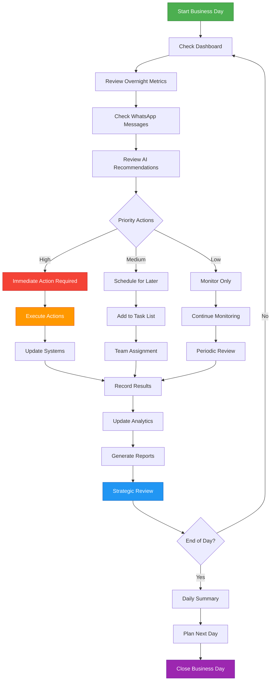

## 💰 **FINANCIAL MANAGEMENT PROCESS**

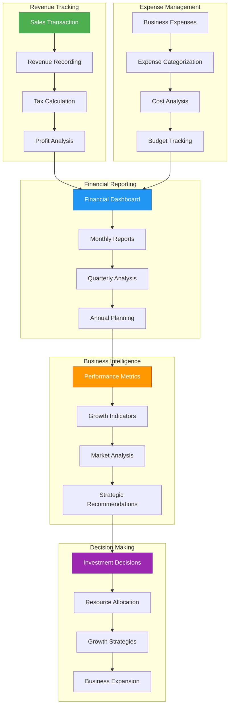

## 🎯 **CUSTOMER JOURNEY MAPPING**

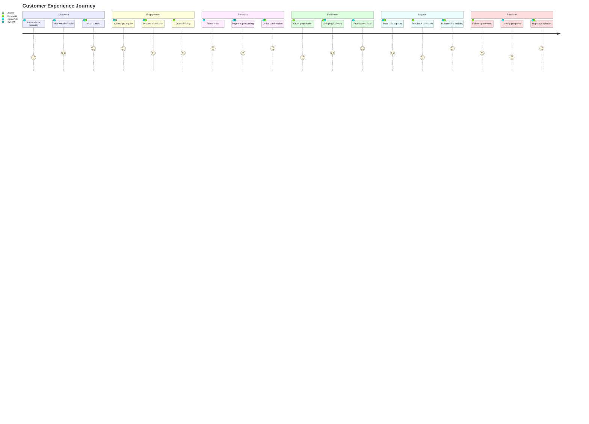

## 🔄 **SYSTEM INTEGRATION MAP**

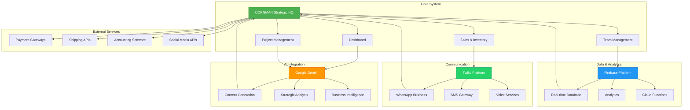

---

## 📋 **PROCESS OPTIMIZATION GUIDELINES**

### **🎯 Key Performance Indicators (KPIs)**
- Response time to customer inquiries < 5 minutes
- Project completion rate > 85%
- Sales conversion rate > 15%
- Team productivity score > 80%
- Customer satisfaction rating > 4.5/5

### **⚡ Automation Opportunities**
- Auto-generate content with AI
- Automated inventory reordering
- Customer inquiry responses
- Sales report generation
- Task assignment based on workload

### **🔄 Continuous Improvement**
- Weekly process review meetings
- Monthly performance analysis
- Quarterly strategic planning
- Annual system optimization
- Regular training updates

---

## 🚀 **SCALING STRATEGIES**

### **📈 Growth Phases**
1. **Startup Phase**: Basic operations, single team
2. **Growth Phase**: Multiple teams, advanced features
3. **Scale Phase**: Enterprise features, multi-location
4. **Enterprise Phase**: Full automation, AI-driven

### **🏗️ Infrastructure Scaling**
- Horizontal scaling with Firebase
- Auto-scaling cloud functions
- CDN optimization for global reach
- Multi-region deployment
- Load balancing implementation

---

**📝 Business Process Notes:**
- All processes are designed for maximum efficiency
- Automation is implemented where possible
- Real-time monitoring ensures quick response
- Scalability is built into every process

---

**🌽 Built with ❤️ by the CORNMAN Team**

*"Optimizing business processes, one kernel at a time."*