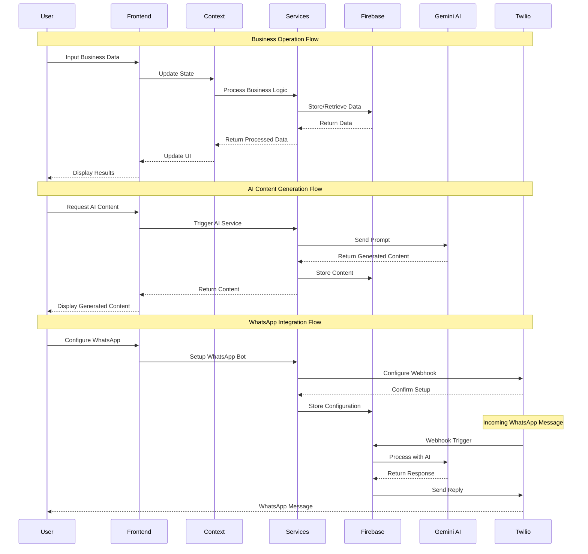
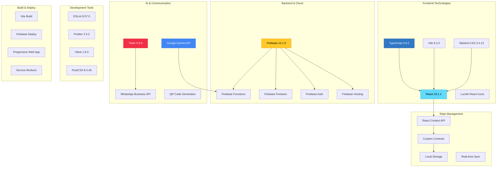
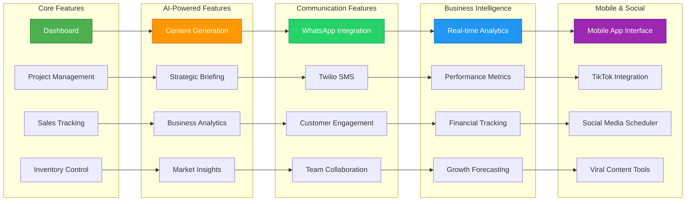
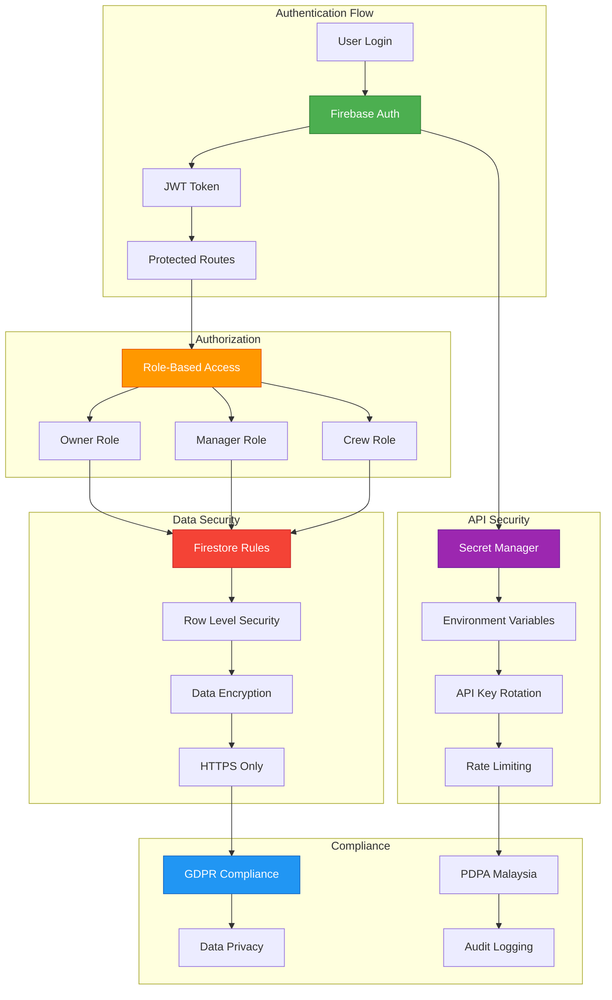
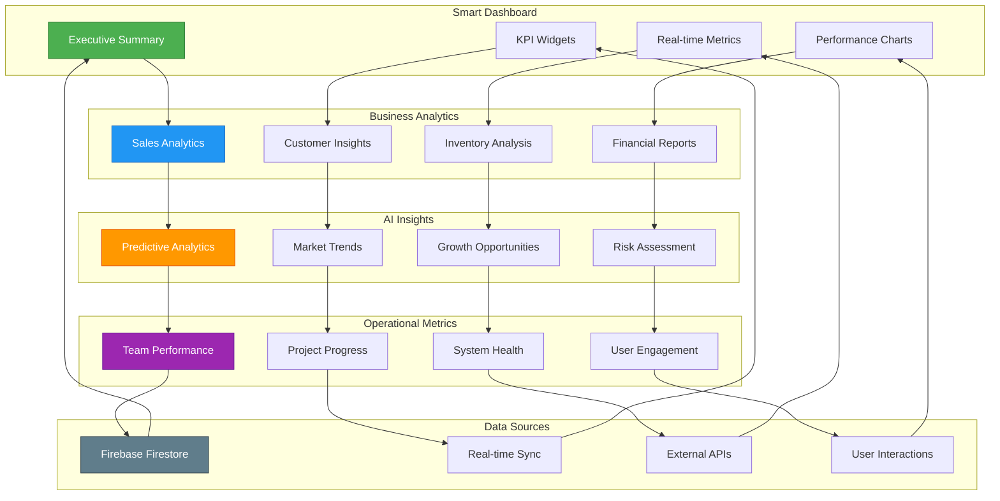

# 🌽 CORNMAN Strategic HQ - Comprehensive Project Diagrams

> **Panduan Visual Lengkap untuk Projek CORNMAN Strategic HQ**
> 
> Dokumen ini mengandungi diagram komprehensif yang menunjukkan struktur projek, arsitektur, dan aliran data.

## 📋 **KANDUNGAN**

1. [🏗️ Arsitektur Sistem Keseluruhan](#-arsitektur-sistem-keseluruhan)
2. [📊 Diagram Struktur Komponen](#-diagram-struktur-komponen)
3. [🔄 Aliran Data dan Integrasi](#-aliran-data-dan-integrasi)
4. [🛠️ Teknologi Stack](#️-teknologi-stack)
5. [📱 Organisasi Feature](#-organisasi-feature)
6. [🔐 Keselamatan dan Autentikasi](#-keselamatan-dan-autentikasi)
7. [📊 Dashboard dan Analytics](#-dashboard-dan-analytics)

---

## 🏗️ **ARSITEKTUR SISTEM KESELURUHAN**

```mermaid
graph TB
    subgraph "Frontend Layer"
        A[React App<br/>TypeScript + Vite] --> B[Component Library]
        A --> C[State Management<br/>Context API]
        A --> D[Routing<br/>React Router]
    end
    
    subgraph "UI Components"
        B --> E[Dashboard Components]
        B --> F[Business Components]
        B --> G[Analytics Components]
        B --> H[Mobile Components]
    end
    
    subgraph "Business Logic"
        C --> I[App State Context]
        C --> J[Auth Context]
        C --> K[Team Context]
        C --> L[Analytics Context]
    end
    
    subgraph "Services Layer"
        M[Firebase Services]
        N[Gemini AI Service]
        O[Twilio WhatsApp]
        P[Analytics Service]
        Q[Team Service]
    end
    
    subgraph "Backend/Cloud"
        R[Firebase Hosting]
        S[Firebase Functions]
        T[Firebase Firestore]
        U[Firebase Auth]
        V[Google Cloud Secret Manager]
    end
    
    subgraph "External APIs"
        W[Google Gemini API]
        X[Twilio WhatsApp API]
        Y[Third-party Integrations]
    end
    
    A --> M
    M --> R
    S --> T
    S --> U
    S --> V
    N --> W
    O --> X
    S --> W
    S --> X
    
    style A fill:#4CAF50,stroke:#2E7D32,color:#fff
    style B fill:#2196F3,stroke:#1565C0,color:#fff
    style C fill:#FF9800,stroke:#E65100,color:#fff
    style M fill:#9C27B0,stroke:#6A1B9A,color:#fff
    style R fill:#F44336,stroke:#C62828,color:#fff
```



---

## 📊 **DIAGRAM STRUKTUR KOMPONEN**

```mermaid
graph TD
    subgraph "App.tsx - Root Application"
        APP[App Component]
    end
    
    subgraph "Features - Main Pages"
        DASH[Dashboard Page]
        PROJ[Projects Page]
        SALES[Sales Page]
        INV[Inventory Page]
        ANAL[Analytics Page]
        TEAM[Team Page]
        WA[WhatsApp Page]
        SET[Settings Page]
    end
    
    subgraph "Shared Components"
        HEAD[Header]
        NAV[Navigation]
        CARD[Card Components]
        UI[UI Components]
        FORM[Form Components]
    end
    
    subgraph "Business Components"
        CREW[Project C.R.E.W.]
        GEN[Generator Cards]
        IMG[Image Generator]
        SCHED[Content Scheduler]
        BRIEF[AI Strategic Briefing]
    end
    
    subgraph "Dashboard Components"
        SMART[Smart Dashboard]
        KPI[KPI Widgets]
        CHARTS[Chart Components]
        METRICS[Metrics Display]
    end
    
    subgraph "Integration Components"
        PHONE[Phone Shell]
        TIKTOK[TikTok Preview]
        WHATS[WhatsApp Interface]
        TWILIO[Twilio Dashboard]
    end
    
    APP --> DASH
    APP --> PROJ
    APP --> SALES
    APP --> INV
    APP --> ANAL
    APP --> TEAM
    APP --> WA
    APP --> SET
    
    DASH --> SMART
    DASH --> KPI
    DASH --> CHARTS
    DASH --> METRICS
    
    PROJ --> CREW
    PROJ --> GEN
    PROJ --> IMG
    
    ALL_PAGES --> HEAD
    ALL_PAGES --> NAV
    ALL_PAGES --> CARD
    ALL_PAGES --> UI
    ALL_PAGES --> FORM
    
    WA --> PHONE
    WA --> WHATS
    WA --> TWILIO
    
    style APP fill:#4CAF50,stroke:#2E7D32,color:#fff
    style CREW fill:#FF9800,stroke:#E65100,color:#fff
    style SMART fill:#2196F3,stroke:#1565C0,color:#fff
    style WHATS fill:#25D366,stroke:#128C7E,color:#fff
```



---

## 🔄 **ALIRAN DATA DAN INTEGRASI**



---

## 🛠️ **TEKNOLOGI STACK**



---

## 📱 **ORGANISASI FEATURE**



---

## 🔐 **KESELAMATAN DAN AUTENTIKASI**



---

## 📊 **DASHBOARD DAN ANALYTICS**



---

## 🗂️ **STRUKTUR DIREKTORI TERPERINCI**

```
cornman---strategic-hq/
├── 📁 src/                           # Source Code Utama
│   ├── 📁 components/                # Komponen React
│   │   ├── 📁 analytics/            # Komponen Analytics
│   │   │   ├── AnalyticsDashboard.tsx
│   │   │   ├── ChartComponents.tsx
│   │   │   └── MetricsDisplay.tsx
│   │   ├── 📁 auth/                 # Komponen Autentikasi
│   │   │   ├── LoginForm.tsx
│   │   │   ├── SignupForm.tsx
│   │   │   └── ProtectedRoute.tsx
│   │   ├── 📁 dashboard/            # Komponen Dashboard
│   │   │   ├── SmartDashboard.tsx
│   │   │   ├── KPIWidgets.tsx
│   │   │   └── ExecutiveSummary.tsx
│   │   ├── 📁 ecommerce/            # Komponen E-commerce
│   │   │   ├── ProductCatalog.tsx
│   │   │   ├── OrderManagement.tsx
│   │   │   └── PaymentIntegration.tsx
│   │   ├── 📁 navigation/           # Komponen Navigasi
│   │   │   ├── Header.tsx
│   │   │   ├── MobileNavigation.tsx
│   │   │   └── Sidebar.tsx
│   │   ├── 📁 primitives/           # Komponen Asas UI
│   │   │   ├── Button.tsx
│   │   │   ├── Card.tsx
│   │   │   ├── Input.tsx
│   │   │   └── Modal.tsx
│   │   ├── 📁 team/                 # Komponen Team
│   │   │   ├── TeamMembership.tsx
│   │   │   ├── TaskAssignment.tsx
│   │   │   └── PerformanceMetrics.tsx
│   │   ├── 📁 whatsapp/             # Komponen WhatsApp
│   │   │   ├── WhatsAppBot.tsx
│   │   │   ├── ChatInterface.tsx
│   │   │   └── BotConfiguration.tsx
│   │   ├── ProjectCrew.tsx          # Sistem Project C.R.E.W.
│   │   ├── GeneratorCard.tsx        # AI Content Generator
│   │   ├── BusinessOS.tsx           # Business Operating System
│   │   └── AiStrategicBriefing.tsx  # AI Strategic Briefing
│   ├── 📁 contexts/                 # React Contexts
│   │   ├── AppStateContext.tsx      # State Management Utama
│   │   ├── AuthContext.tsx          # Autentikasi Context
│   │   ├── AnalyticsContext.tsx     # Analytics Context
│   │   ├── TeamContext.tsx          # Team Management Context
│   │   └── ThemeContext.tsx         # Theme Management
│   ├── 📁 features/                 # Feature-based Organization
│   │   ├── 📁 analytics/            # Analytics Feature
│   │   ├── 📁 dashboard/            # Dashboard Feature
│   │   ├── 📁 inventory/            # Inventory Feature
│   │   ├── 📁 projects/             # Projects Feature
│   │   ├── 📁 sales/                # Sales Feature
│   │   ├── 📁 settings/             # Settings Feature
│   │   └── 📁 whatsapp/             # WhatsApp Feature
│   ├── 📁 hooks/                    # Custom React Hooks
│   │   ├── useAppState.ts           # App State Hook
│   │   ├── useAuth.ts               # Authentication Hook
│   │   ├── useAnalytics.ts          # Analytics Hook
│   │   └── useRealTimeSync.ts       # Real-time Synchronization
│   ├── 📁 services/                 # Business Logic Services
│   │   ├── firebase.ts              # Firebase Configuration
│   │   ├── geminiService.ts         # Google Gemini AI Service
│   │   ├── twilioService.ts         # Twilio WhatsApp Service
│   │   ├── analytics.ts             # Analytics Service
│   │   ├── teamService.ts           # Team Management Service
│   │   └── ecommerceService.ts      # E-commerce Service
│   ├── 📁 types/                    # TypeScript Type Definitions
│   │   ├── index.ts                 # Core Types
│   │   ├── team.ts                  # Team Types
│   │   ├── ecommerce.ts             # E-commerce Types
│   │   ├── analytics.ts             # Analytics Types
│   │   └── integrations.ts          # Integration Types
│   ├── 📁 utils/                    # Utility Functions
│   │   ├── constants.ts             # Application Constants
│   │   ├── helpers.ts               # Helper Functions
│   │   └── validators.ts            # Validation Functions
│   ├── App.tsx                      # Root Application Component
│   └── index.tsx                    # Application Entry Point
├── 📁 functions/                    # Firebase Cloud Functions
│   ├── 📁 src/                      # Functions Source Code
│   │   ├── gemini.ts                # Gemini AI Functions
│   │   ├── whatsapp.ts              # WhatsApp Webhook Functions
│   │   └── analytics.ts             # Analytics Functions
│   └── package.json                 # Functions Dependencies
├── 📁 public/                       # Static Assets
│   ├── manifest.json                # PWA Manifest
│   ├── favicon.ico                  # Application Icon
│   └── apple-touch-icon.png         # iOS Icon
├── 📁 docs/                         # Documentation
│   ├── 📁 api/                      # API Documentation
│   ├── 📁 setup/                    # Setup Guides
│   ├── 📁 architecture/             # Architecture Documentation
│   └── 📁 deployment/               # Deployment Guides
├── package.json                     # Project Dependencies
├── vite.config.ts                   # Vite Configuration
├── tailwind.config.ts               # Tailwind CSS Configuration
├── tsconfig.json                    # TypeScript Configuration
├── firebase.json                    # Firebase Configuration
└── README.md                        # Project Documentation
```

---

## 🎯 **KOMPONEN UTAMA DAN FUNGSINYA**

### **Dashboard Components**
- **SmartDashboard**: Dashboard utama dengan KPI real-time
- **AiStrategicBriefing**: Briefing strategik berdasarkan AI
- **AnalyticsDashboard**: Dashboard analytics mendalam

### **Business Management**
- **ProjectCrew**: Sistem pengurusan projek C.R.E.W.
- **BusinessOS**: Sistem operasi perniagaan terpadu
- **CustomerHub**: Pengurusan hubungan pelanggan

### **AI-Powered Tools**
- **GeneratorCard**: Penjana kandungan AI
- **ImageGeneratorCard**: Penjana imej AI
- **ContentScheduler**: Penjadual kandungan automatik

### **Communication & Integration**
- **WhatsAppBot**: Bot WhatsApp pintar
- **TwilioDashboard**: Dashboard integrasi Twilio
- **PhoneShell**: Interface komunikasi mobile

### **Analytics & Reporting**
- **PerformanceMetrics**: Metrik prestasi real-time
- **ChartComponents**: Komponen carta interaktif
- **RevenueTracking**: Jejak pendapatan dan keuntungan

---

## 🔄 **ALIRAN KERJA SISTEM**

### **1. User Authentication Flow**
```
Login → Firebase Auth → JWT Token → Protected Routes → Dashboard
```

### **2. Business Data Flow**
```
User Input → Context State → Service Layer → Firebase → Real-time Updates
```

### **3. AI Content Generation Flow**
```
User Request → Gemini Service → AI Processing → Content Storage → UI Display
```

### **4. WhatsApp Integration Flow**
```
WhatsApp Message → Twilio Webhook → Firebase Function → AI Processing → Auto Reply
```

### **5. Analytics Processing Flow**
```
User Actions → Event Tracking → Data Aggregation → Real-time Dashboard → Insights
```

---

## 🚀 **CARA PENGGUNAAN DIAGRAM**

### **Untuk Developer:**
1. Gunakan **Struktur Direktori** untuk navigasi kod
2. Rujuk **Arsitektur Sistem** untuk memahami aliran data
3. Ikut **Komponen Diagram** untuk pembangunan feature baru

### **Untuk Project Manager:**
1. Gunakan **Organisasi Feature** untuk planning sprint
2. Rujuk **Aliran Kerja** untuk memahami proses bisnes
3. Monitor **Dashboard Analytics** untuk KPI tracking

### **Untuk Business User:**
1. Fahami **Feature Map** untuk penggunaan sistem
2. Ikut **User Flow** untuk operasi harian
3. Gunakan **Dashboard** untuk monitoring perniagaan

---

**📝 Nota:** Diagram ini adalah representasi visual terkini projek CORNMAN Strategic HQ. Untuk maklumat terkini, sila rujuk dokumentasi kod dan README.md.

---

**🌽 Built with ❤️ by the CORNMAN Team**

*"Transforming businesses, one kernel at a time."*